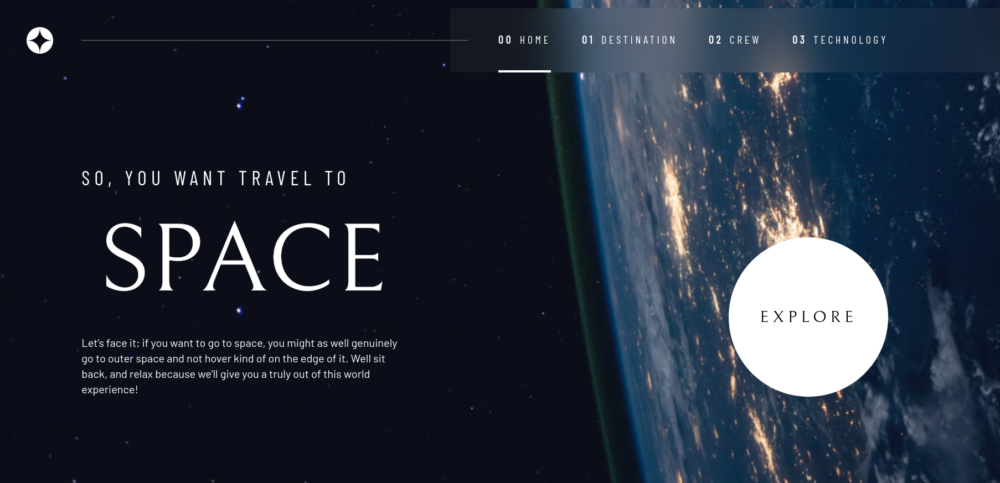
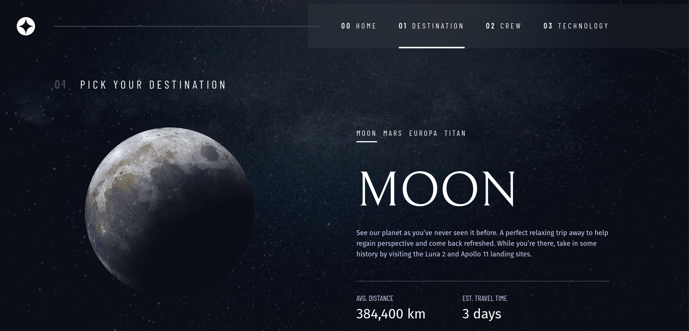

# Frontend Mentor - Space tourism website solution

This is a solution to the [Space tourism website challenge on Frontend Mentor](https://www.frontendmentor.io/challenges/space-tourism-multipage-website-gRWj1URZ3). Frontend Mentor challenges help you improve your coding skills by building realistic projects. 

## Table of contents

- [Overview](#overview)
  - [The challenge](#the-challenge)
  - [Screenshot](#screenshot)
  - [Links](#links)
- [My process](#my-process)
  - [Built with](#built-with)
- [Author](#author)

## Overview

### The challenge

Users should be able to:

- View the optimal layout for each of the website's pages depending on their device's screen size
- See hover states for all interactive elements on the page
- View each page and be able to toggle between the tabs to see new information

### Screenshots





### Links
- [Challenge site](https://www.frontendmentor.io/challenges/space-tourism-multipage-website-gRWj1URZ3)
- [Solution code](https://github.com/nicolsam/space-tourism)
- [Live site](https://space-tourism-sandy.vercel.app/)

## My process

### Built with

- Semantic HTML5 markup
- CSS custom properties
- Flexbox
- CSS Grid
- Mobile-first workflow
- [React](https://reactjs.org/) - JS library
- [Vite.js](https://vitejs.dev/) - React framework
- [Styled Components](https://styled-components.com/) - For styles
- [TailwindCSS](https://tailwindcss.com/) - CSS framework packed with classes

### What I learned

Able to set custom fonts for tailwind classes

```js
module.exports = {
  theme: {
    fontFamily: {
      'barlow': ['Barlow', 'sans-serif', '"Open Sans"'],
    },
  }
}
```

```html
<h1 className="font-barlow">Some HTML code</h1>
```


## Author

- Website - [Nicolas Samuel](https://www.nicolsam.space/)
- Frontend Mentor - [@nicolsam](https://www.frontendmentor.io/profile/nicolsam)
- Linkedin - [@nicolveras](https://www.linkedin.com/in/nicolveras/)
